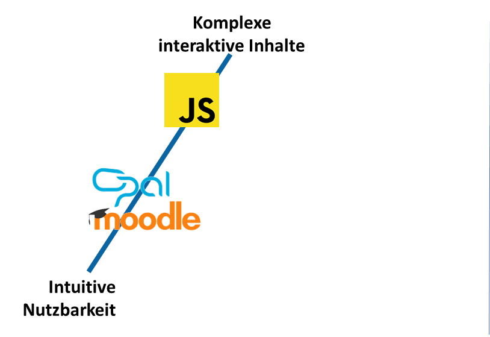
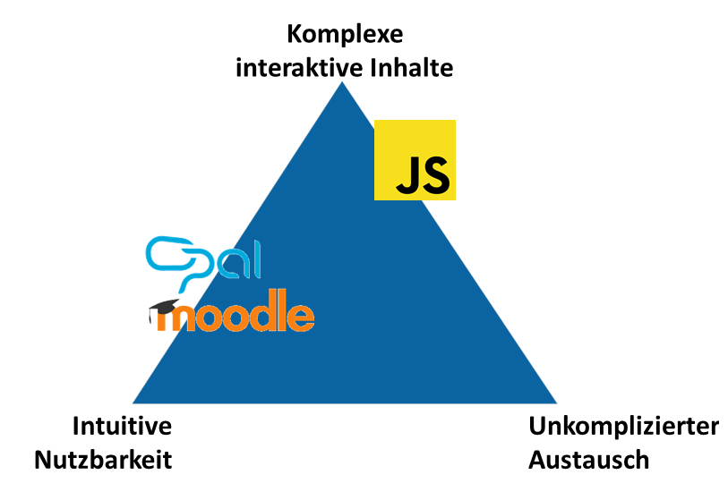
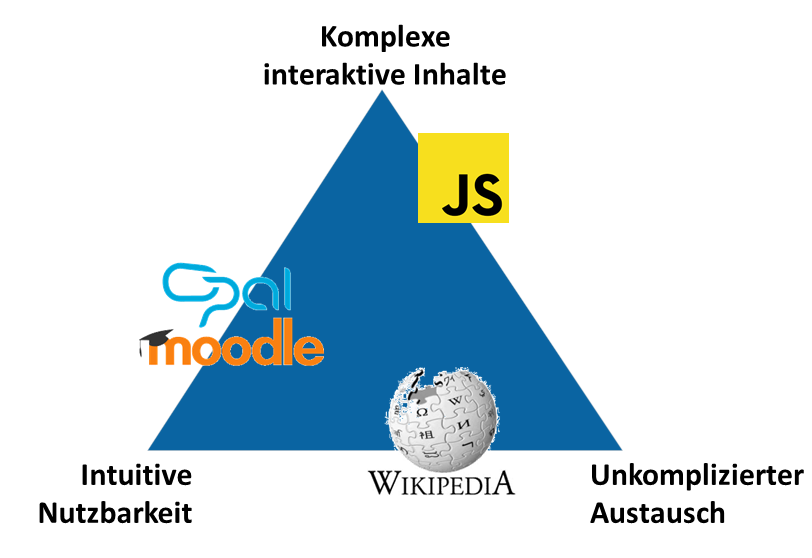
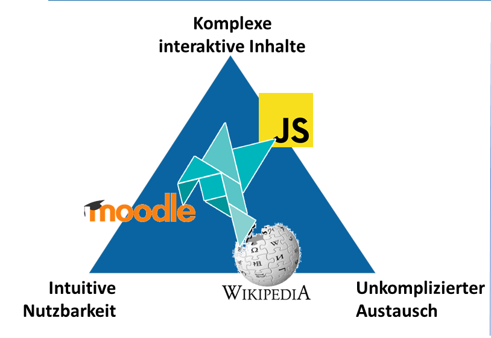
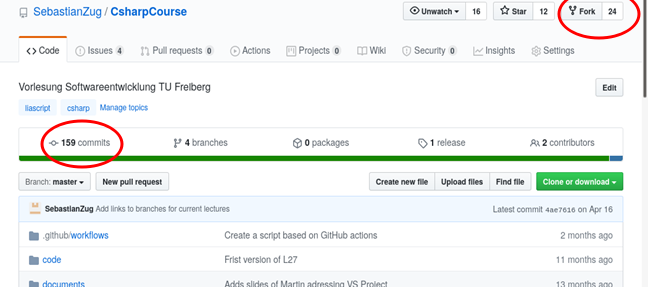

<!--
author:   Sebastian Zug & André Dietrich
email:    andre.dietrich@Informatik.tu-freiberg.de
version:  0.0.5
language: de
narrator: Deutsch Male
logo:     logo.jpg

comment:  Demo für den das Webinar vom 16.04.2020 in Freiberg.
          Link zur Aufzeichnung: https://www.youtube.com/watch?v=-JyKxvAkAP0

import: https://raw.githubusercontent.com/liaTemplates/rextester/master/README.md

-->

# Freie Lehr-Lern-Materialien ohne Wenn und Aber

**Die Entwicklung von interaktiven Vorlesungen mit LiaScript**

_Tag der Lehre 2020_

Sebastian Zug, Andrè Dietrich (Technische Bergakademie Freiberg)

--------------------------------------------------

_Ablauf:_

1. Motivation des Konzeptes (10 Min)
2. Tutorial (35-40 Min)
3. Fragen und Feedbacks (10 Min)

--------------------------------------------------

**Herzlich Willkommen!** <!-- style = "color: blue;" -->

## Widerspruch der Digitalen Lehre

                 {{0-1}}
************************************************

<!--
style="width: 100%; max-width: 560px; display: block; margin-left: auto; margin-right: auto;"
-->

************************************************

                  {{1-2}}
************************************************

<!--
style="width: 100%; max-width: 560px; display: block; margin-left: auto; margin-right: auto;"
-->

************************************************

                  {{2-4}}
************************************************

<!--
style="width: 100%; max-width: 560px; display: block; margin-left: auto; margin-right: auto;"
-->

************************************************

                  {{3-4}}
************************************************

```
== Geschichte ==

Die [[Bergakademie]] Freiberg wurde 1765, in der Zeit der [[Aufklärung]], durch
[[Franz Xaver von Sachsen|Prinz Xaver von Sachsen]] nach den Plänen von
[[Friedrich Wilhelm von Oppel]] (1720–1767) und [[Friedrich Anton von Heynitz]]
unter dem Namen ''Kurfürstlich-Sächsische Bergakademie zu Freiberg''
```

<!--
style="width: 100%; max-width: 560px; display: block; margin-left: auto; margin-right: auto;"
-->


************************************************

## LiaScript-Konzept

<!--
style="width: 100%; max-width: 560px; display: block; margin-left: auto; margin-right: auto;"
-->

Verknüpfung der orthogonalen Zielstellungen über eine erweiterte Beschreibungssprache mit:

+ dynamischen Inhalte zur Umsetzung lehrrelevanter Formate (Quizze, Animationen, Grafiken)
+ einer serverlosen Bearbeitung- und Ausführungsumgebung
+ Schnittstellen zur Erweiterung mittels Plugins und der Integration in etablierte LMS


## Bearbeitungsphasen

    {{0-1}}
************************************************

<!--
style="width: 100%; max-width: 560px; display: block; margin-left: auto; margin-right: auto;"
-->
```ascii

Generierung                    Publikation          Konsum durch Lernende


    | Plugin A                                      ╔══════╡ Browser   ╞══════╗
    |  | Plugin B                           nativ   ║ Digitale Systeme        ║
    v  v                                  +-------> ║ (WiSe 2020)             ║
+---------------------+                   |         ║                         ║
| # Digitale Systeme  |\          .-,(  ),-.        ╚═════════════════════════╝
| (WiSe 2020)         +-+      .-(          )-.
|                       | --> ( Cloud Speicher )    ╔══════╡ OPAL      ╞══════╗
| Fallbeispiele         |      '-(         ).-'     ║ Digitale Systeme        ║
| + ...                 |         '-.( ).-' SCORM   ║ (WiSe 2020)             ║
+-----------------------+                 +-------> ║                         ║
                                          |         ╚═════════════════════════╝
                                          |
                                          |         ╔══════╡ pdfViewer ╞══════╗
                                          | export  ║ Digitale Systeme        ║
                                          +-------> ║ (WiSe 2020)             ║
                                                    ║                         ║
                                                    ╚═════════════════════════╝   .
```

************************************************

    {{1-2}}
************************************************

<!--
style="width: 100%; max-width: 560px; display: block; margin-left: auto; margin-right: auto;"
-->
```ascii

Generierung                    Publikation          Konsum durch Lernende

                   ::::::::::::::::::::::::::Feedbacks:::::::::::::::::::::::::::::
                   ::                                                            ::
    | Plugin A     ::                               ╔══════╡ Browser   ╞══════╗  ::
    |  | Plugin B  ::                       nativ   ║ Digitale Systeme        ║  ::
    v  v           vv                     +-------> ║ (WiSe 2020)             ║::::
+---------------------+                   |         ║                         ║  ::
| # Digitale Systeme  |\          .-,(  ),-.        ╚═════════════════════════╝  ::
| (WiSe 2020)         +-+      .-(          )-.                                  ::
|                       | --> ( Cloud Speicher )    ╔══════╡ OPAL      ╞══════╗  ::
| Fallbeispiele         |      '-(         ).-'     ║ Digitale Systeme        ║  ::
| + ...                 |         '-.( ).-' SCORM   ║ (WiSe 2020)             ║::::
+-----------------------+                 +-------> ║                         ║  ::
                                          |         ╚═════════════════════════╝  ::
                                          |                                      ::
                                          |         ╔══════╡ pdfViewer ╞══════╗  ::
                                          | export  ║ Digitale Systeme        ║  ::
                                          +-------> ║ (WiSe 2020)             ║::::
                                                    ║                         ║
                                                    ╚═════════════════════════╝
```

************************************************

    {{2-3}}
************************************************

<!--
style="width: 100%; max-width: 560px; display: block; margin-left: auto; margin-right: auto;"
-->

************************************************

# Und nun


... wird des praktisch


## Allgemeine Struktur


## PowerPoint & Sprechen Lernen


         --{{1}}--
Zuerst erscheint eine Tabelle.


          {{1-2}}
| Header 1 | Header 2 | Header 3 |
|:-------- |:-------- |:-------- |
| Item 1   | Item 2   | Item 3   |
| test     |          | Wichtig  |

         --{{2}}--
Und dann eine Liste mit wichtigen Punkten.


           {{2}}
* Dies ist
* eine __kleine__
* Liste {3}{_wichtiger_} Informationen.


    --{{3 Russian Male}}--
Markdown (произносится маркда́ун) — облегчённый язык разметки, созданный с целью
написания наиболее читаемого и удобного для правки текста, но пригодного для
преобразования в языки для продвинутых публикаций (HTML, Rich Text и других).

## Quizfrage?


Hat ihnen das gefallen?

    [[Ja]]
    <script>
      // @input will be replace by the user input
      let input_string = "@input";
      "ja" == input_string.trim().toLowerCase();
    </script>


Wie hat Ihnen der Kurs gefallen?


    [[X]] Gut
    [[X]] Super
    [[ ]] Schlecht
    [[?]] Es gibt zwei mögliche Anworten
    [[?]] Es gibt zwei mögliche Anworten
    [[?]] Die ersten beiden
    ****************************************

    Add a solution explanation __Markdown__!

    $$
       \sum_{i=1}^\infty\frac{1}{n^2}
            =\frac{\pi^2}{6}
    $$

    ****************************************


## Programmieren im Browser


```javascript
var s = "JavaScript syntax highlighting";
alert(s);
```
<script>@input</script>


## Teilen und Herrschen (mit Plugins)


```armasm
;nasm 2.11.08

section .data
    hello:     db 'Hello world!',10    ; 'Hello world!' plus a linefeed character
    helloLen:  equ $-hello             ; Length of the 'Hello world!' string

section .text
	global _start

_start:
	mov eax,4            ; The system call for write (sys_write)
	mov ebx,1            ; File descriptor 1 - standard output
	mov ecx,hello        ; Put the offset of hello in ecx
	mov edx,helloLen     ; helloLen is a constant, so we don't need to say
	                     ;  mov edx,[helloLen] to get it's actual value
	int 80h              ; Call the kernel

	mov eax,1            ; The system call for exit (sys_exit)
	mov ebx,0            ; Exit with return code of 0 (no error)
	int 80h;
```
@Rextester.eval(@Nasm)


https://github.com/LiaTemplates/


## (Gimmicks)

Tabellen & Diagramme & Multimedia


                                    Multiline
    1.9 |
        |                 ***
      y |               *     *
      - | r r r r r r r*r r r r*r r r r r r r
      a |             *         *
      x |            *           *
      i | B B B B B * B B B B B B * B B B B B
      s |         *                 *
        | *  * *                       * *  *
     -1 +------------------------------------
        0              x-axis               1


## Fun avec Sprachen


## Spaß mit Tabellen


### Diagramme


### Graphen


## Upload ... Wohin?

https://LiaScript.github.io/course/?

oder

https://LiaScript.io/course/?

### GitHub


https://github.com/LiaScript/Workshop


### DropBox


### Moodle und andere LMS


https://github.com/LiaScript/LiaScript-Exporter/

`liaex -i README.md -f scorm1.2 -o Workshop_ --masteryScore 20`


## Weitere Quellen


https://LiaScript.github.io

https://github.com/LiaBooks

https://www.youtube.com/watch?v=w_CRABsJNKA&t=10s

https://www.youtube.com/watch?v=-JyKxvAkAP0

https://www.youtube.com/channel/UCyiTe2GkW_u05HSdvUblGYg


# Fragen
